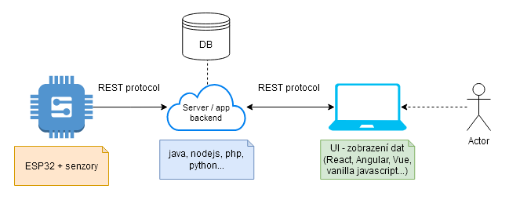
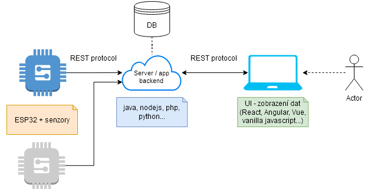
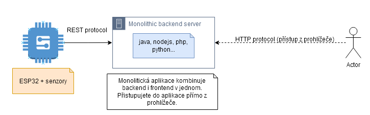
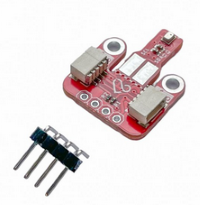
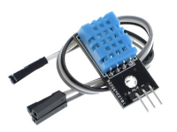
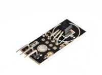
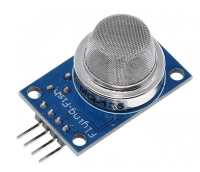
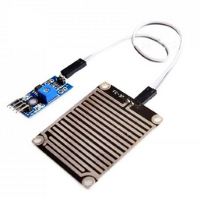
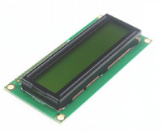
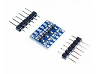

# IoT meteostanice

V tomto projektu nejde pouze o hardwarové řešení. Dojde i na spoustu programování mimo Arduino IDE. Nepodceňujte práci na serverové části meteostanice a na uživatelském rozhraní pro koncového uživatele :)

Celá architektura projektu je ve vašich rukou, ale nastřelíme vám zde některé možné pohledy na věc :)

### ESP32 meteostanice jako klient + centrální server + frontend aplikace pro prezentaci dat

### ESP32 meteostanice jako vnitřní a venkovní klient + centrální server + frontend aplikace pro prezentaci dat

### ESP32 meteostanice jako klient + monolitický server

## Vybavení

### Vývojové desky

Desky máte k dispozici dvě (od každého typu max jednu). Nemusíte použít obě. Takto můžete/nemusíte rozdělit meteostanici na vnitřní a venkovní čidlo (v tomto případě zvolte rozumně typ senzorů pro obě zařízení) nebo např. použít jedno zařízení jako server a druhé jako klient.

| Vývojová deska   | Obrázek   | Detaily |
| ----------- | ----------- | ----------- |
| MH-ET LIVE ESP32 MiniKIT (Wemos D1 mini)   |         | <ul><li>[Schéma](/image/d1_schema.png)</li><li>[Tutoriál](https://randomnerdtutorials.com/getting-started-with-esp32/)</li></ul>   |
| LoLin 32 ESP-WROOM-32 2.4GHz Dual-Mode WiFi+Bluetooth, CP2102 |   |  <ul><li>[Schéma](/image/lolin_schema.png)</li><li>[Tutoriál](https://randomnerdtutorials.com/getting-started-with-esp32/)</li></ul>   |

### Seznam dostupných senzorů

Od každého typu senzoru máte dostupný jeden kus. Není zapotřebí použít všechny - máme jich k diszpozici záměrně více, abyste mohli vymyslet svoje vlastní řešení meteostanice. Většina senzorů pracuje s napětím 3.3V, pozor na MQ-135 (kvalita vzduchu) - tento senzor je 5V (nespalte pin na ESP32 desce, která je 3.3V).

<table>
    <thead>
        <tr>
            <th>Senzor</th>
            <th>Obrázek</th>
            <th>TL;DR</th>
            <th>Detaily</th>
        </tr>
    </thead>
    <tbody>
        <tr>
            <td><strong>BMP280</strong> čidlo teploty a tlaku</td>
            <td></td>
            <td>
                <ul>
                    <li>3.3V</li>
                    <li>I2C (adresa 0x77)</li>
                    <li>knihovna Adafruit BMP280</li>
                </ul>
            </td>
            <td>
                <ul>
                    <li><a href="https://www.laskakit.cz/laskakit-bmp280-senzor-tlaku-a-teploty-vzduchu/#description">Produktová stránka</a></li>
                    <li><a href="https://www.laskakit.cz/user/related_files/bst-bmp280-ds001-11.pdf">Datasheet</a></li>
                    <li><a href="https://www.circuitschools.com/interfacing-bmp280-with-esp-32-on-i2c-with-errors-and-solutions/">Tutoriál</a></li>
                </ul>
            </td>
        </tr>
        <tr>
            <td><strong>ASAIR DHT11</strong> čidlo teploty a vlhkosti</td>
            <td></td>
            <td>
                <ul>
                    <li>3-5V</li>
                    <li>1 data PIN</li>
                    <li>knihovna DHT sensor library</li>
                </ul>
            </td>
            <td>
                <ul>
                    <li><a href="https://www.laskakit.cz/arduino-senzor-teploty-a-vlhkosti-vzduchu-dht11--modul/#description">Produktová stránka</a></li>
                    <li><a href="https://www.laskakit.cz/user/related_files/dht11.pdf">Datasheet</a></li>
                    <li><a href="https://randomnerdtutorials.com/esp32-dht11-dht22-temperature-humidity-sensor-arduino-ide/">Tutoriál</a></li>
                </ul>
            </td>
        </tr>
        <tr>
            <td><strong>Dallas DS18B20</strong> čidlo teploty</td>
            <td></td>
            <td>
                <ul>
                    <li>3.0-5.5V</li>
                    <li>1 data PIN</li>
                    <li>knihovna DallasTemperature</li>
                </ul>
            </td>
            <td>
                <ul>
                    <li><a href="https://www.laskakit.cz/digitalni-cidlo-teploty-dallas-ds18b20--modul/#description">Produktová stránka</a></li>
                    <li><a href="https://www.laskakit.cz/user/related_files/umw-youtai-semiconductor-co-ltd-ds18b20.pdf">Datasheet</a></li>
                    <li><a href="https://randomnerdtutorials.com/esp32-ds18b20-temperature-arduino-ide/">Tutoriál</a></li>
                </ul>
            </td>
        </tr>
        <tr>
            <td><strong>MQ-135</strong> čidlo kvality ovzduší</td>
            <td></td>
            <td>
                <ul>
                    <li style="color: red">5V</li>
                    <li>1 analog PIN (neměřená hodnota)</li>
                    <li>1 digital PIN (pouze OK / nOK)</li>
                    <li>knihovny MQ135 nebo MQUnifiedsensor</li>
                    <li>.. nebo bez knihovny :)</li>
                </ul>
            </td>
            <td>
                <ul>
                    <li><a href="https://www.laskakit.cz/senzor-pro-detekci-kvality-vzduchu-mq-135/#description">Produktová stránka</a></li>
                    <li><a href="https://www.laskakit.cz/user/related_files/mq135.pdf">Datasheet</a></li>
                    <li><a href="https://blog.asksensors.com/air-quality-sensor-mq135-cloud-mqtt/">Tutoriál</a></li>
                </ul>
            </td>
        </tr>
        <tr>
            <td><strong>dešťový senzor / komparátor LM393</strong></td>
            <td></td>
            <td>
                <ul>
                    <li>3.3-5V</li>
                    <li>1 analog PIN</li>
                    <li>1 digital PIN</li>
                </ul>
            </td>
            <td>
                <ul>
                    <li><a href="https://www.laskakit.cz/destovy-senzor/#description">Produktová stránka</a></li>
                    <li><a href="https://www.laskakit.cz/user/related_files/lm393-d.pdf">Datasheet</a></li>
                    <li><a href="https://thinkrobotics.com/products/rain-detection-sensor-with-lm393-comparator">Tutoriál</a></li>
                </ul>
            </td>
        </tr>
    </tbody>
</table>

### Doplňkové vybavení

Od každé položky máte dostupný jeden kus.

<table>
    <thead>
        <tr>
            <th>Senzor</th>
            <th>Obrázek</th>
            <th>TL;DR</th>
            <th>Detaily</th>
        </tr>
    </thead>
    <tbody>
        <tr>
            <td><strong>LCD Display 1602</strong> 2 řádkový</td>
            <td></td>
            <td>
                <ul>
                    <li>5V !!!</li>
                    <li>bez I2C - nutno zapojit 12 konektorů</li>
                    <li>musíte se poprat se zapojením bez potenciometru</li>
                    <li>knihovna LiquidCrystal</li>
                </ul>
            </td>
            <td>
                <ul>
                    <li><a href="https://www.laskakit.cz/16x2-lcd-displej-1602-zeleny/#description">Produktová stránka</a></li>
                    <li><a href="https://www.circuitschools.com/interfacing-16x2-lcd-module-with-esp32-with-and-without-i2c/">Tutoriál</a></li>
                </ul>
            </td>
        </tr>
        <tr>
            <td>Digitální převodník 3.3V <-> 5V</td>
            <td></td>
            <td>
                <ul>
                    <li>převod 3.3V <-> 5V</li>
                    <li>zadání jde vyřešit bez této součástky</li>
                </ul>
            </td>
            <td>
                <ul>
                    <li><a href="https://www.laskakit.cz/4-kanaly-obousmerny-prevodnik-logickych-urovni-5v-a-3-3v/#description">Produktová stránka</a></li>
                </ul>
            </td>
        </tr>
    </tbody>
</table>

### Propojovací materiál apod

- Breadboard (max 2 kusy)
- Propojovácí dráty
- Tlačítka
- Svorkovnice
- PCB deska (pokud se rozhodnete odevzdat řešení jinak než na breadboardu)
- Li-Poly baterie (máme celkem 2 kusy, tak si ji vezměte pouze pokud máte dobrý případ užití)
